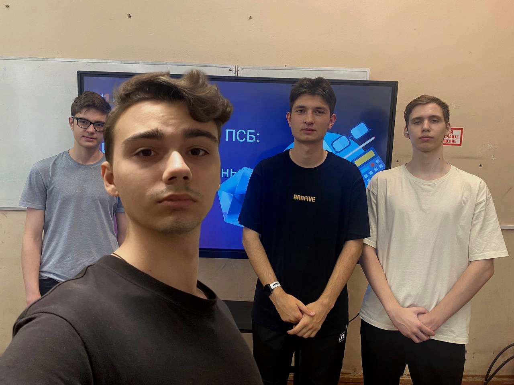

## Мероприятие 3: Мастер-класс «Искусство превращать данные в успех»

**Автор:** Ночной Максим Сергеевич  
**Группа:** 241-327

---

- **📅 Дата проведения:** 22 апреля 2025 г.  
- **🕒 Время:** 14:30  
- **📍 Место:** г. Москва, ул. Павла Корчагина, д. 22, ауд. 221  
- **🏛️ Организатор:** Московский Политех  
- **📌 Формат участия:** Очно  

---

   

## 📘 Описание мероприятия

Мастер-класс был посвящён исследовательской работе в банке ПСБ и применению аналитических данных для решения прикладных задач в финансовой сфере. Участники ознакомились с практическими кейсами, над которыми работают специалисты, и попробовали применить свои знания на практике.

---

## 🔑 Ключевые моменты

### 1. Знакомство с ПСБ как индустриальным партнёром
- Представление цифровых инициатив и флагманских проектов банка.
- Информация о карьерных возможностях и программах для студентов.

### 2. Работа с кейсами
- Обсуждение реальных аналитических задач, решаемых в банке.
- Демонстрация всех этапов обработки данных — от запроса до итогового решения.

### 3. Практическая часть
- Формирование команд и работа над задачами.
- Обсуждение решений и подходов совместно с экспертами ПСБ.
