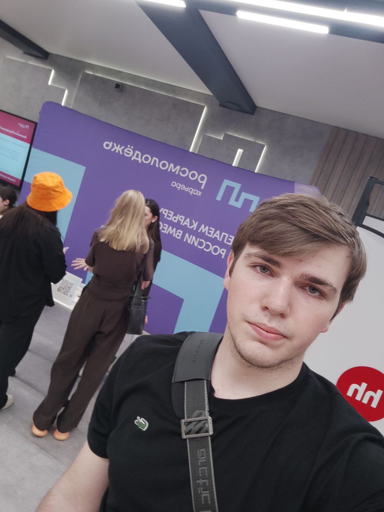
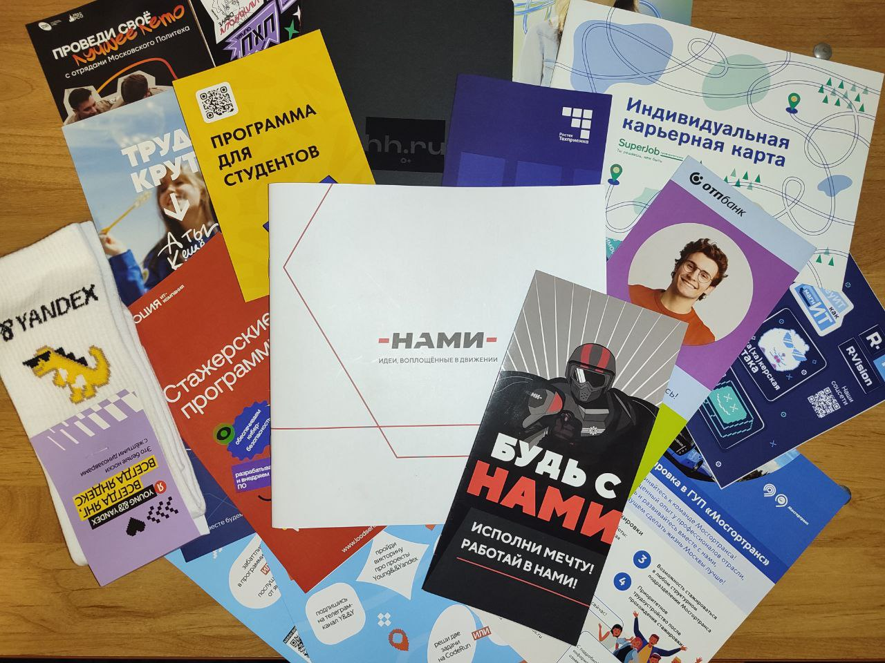
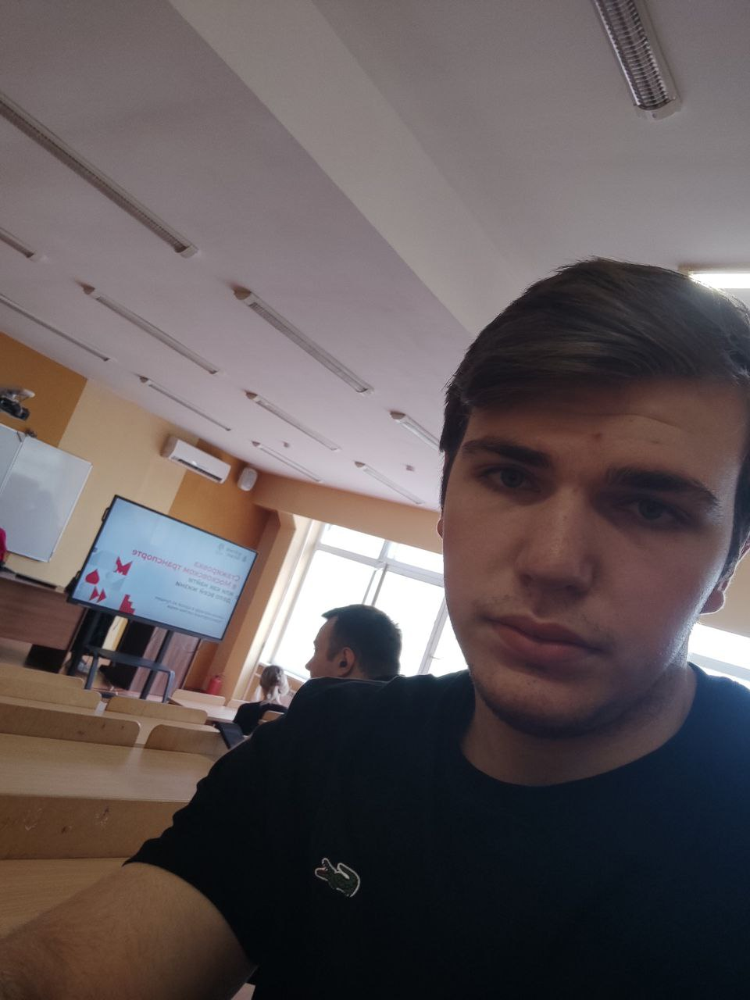

# Отчёт о взаимодействии с организацией-партнёром  

**Автор:** Шмыговский Никита Сергеевич  
**Группа:** 241-327

---

## Мероприятие 1: Выставка индустриальных партнеров  

**Дата проведения:** 22 апреля 2025 г.  
**Организатор:** Московский Политех  
**Формат участия:** Очно  

### Описание мероприятия  
Выставка объединила ведущие IT-компании и стартапы Москвы. Участники могли познакомиться с проектами партнёров, пройти интерактивные задания и пообщаться с представителями индустрии.  

### Ключевые моменты  
1. **Стенд Яндекса**:  
   - Решение алгоритмических задач.  
   - Сборка оригами из бумаги.  

2. **Стенд Wildberries**:  
   - Блиц-опрос по основам программирования и тестирования.  
   - кроссворд по теме истории компании Wildberries.  

3. **Стенд HeadHunter**:  
   - Создание цифрового резюме за 5 минут.    

### Фотографии  
  
*Я напротив стенда Росмолодежи*
  
*Я напротив стенда Оптобанка*
 
*Все что унес с выставки*
---

## Мероприятие 2: Мастер-класс "Стажировка в Московском транспорте"  

**Дата проведения:** 23 апреля 2025 г.  
**Организатор:** Московский транспорт  
**Формат участия:** Очно  

### Описание мероприятия  
Семинар посвящён карьерным возможностям в государственном секторе. Эксперты поделились кейсами внедрения цифровых решений в транспортную инфраструктуру Москвы.  

### Ключевые моменты  
**Требования к стажёрам**:  
   - Акцент на знание JavaScript и работу с API.  
   - Прямая связь с технологическим стеком нашего проекта. 

 - Начало стажировки будет в середине июля.
 - Идея: адаптировать EasyAccess для мобильных приложений транспорта (например, озвучивание маршрутов для слабовидящих).  
 

### Фотографии  
 
*Я в аудитории где проходило мероприятие*

---

## Выводы и связь с проектом  
1. **Карьерные перспективы**:  
   - Требования к стажёрам (JavaScript, API) подтверждают правильность выбранного технологического стека для проекта.  

2. **Социальный контекст**:  
   - Проект EasyAccess соответствует тренду на цифровизацию социально значимых сервисов, что повышает его актуальность.  

---

**Примечание:**  
Фотографии добавлены в репозиторий в папку `./images/`.