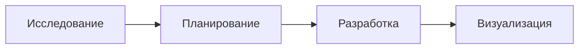
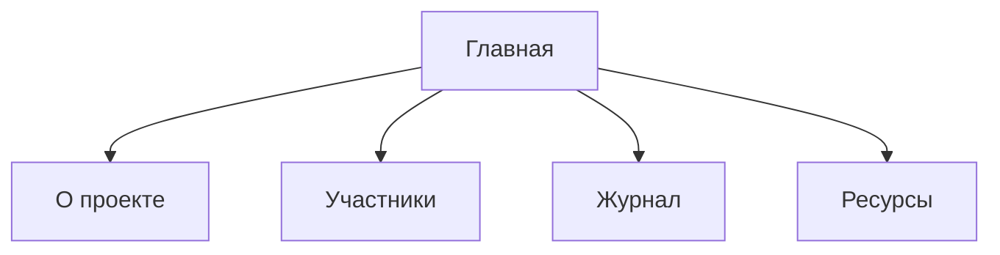
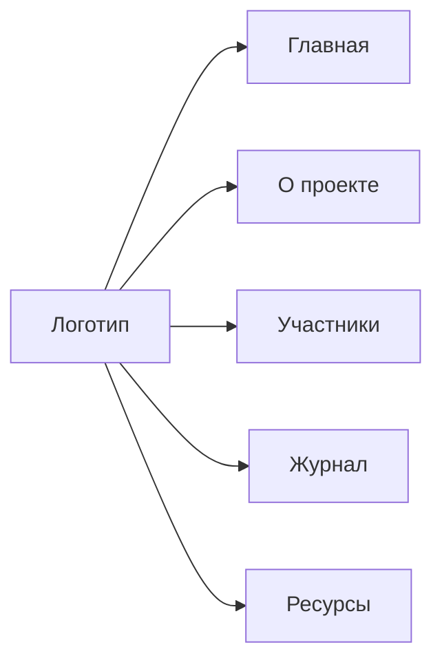
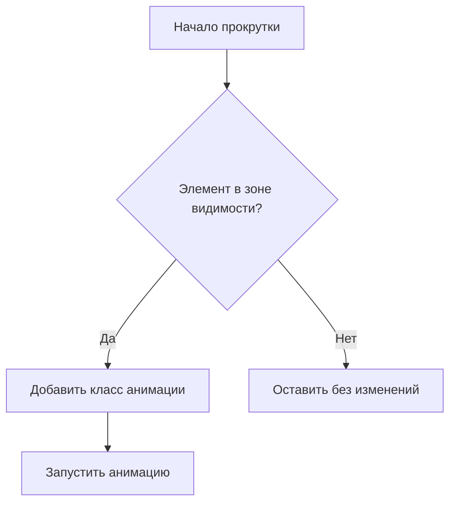
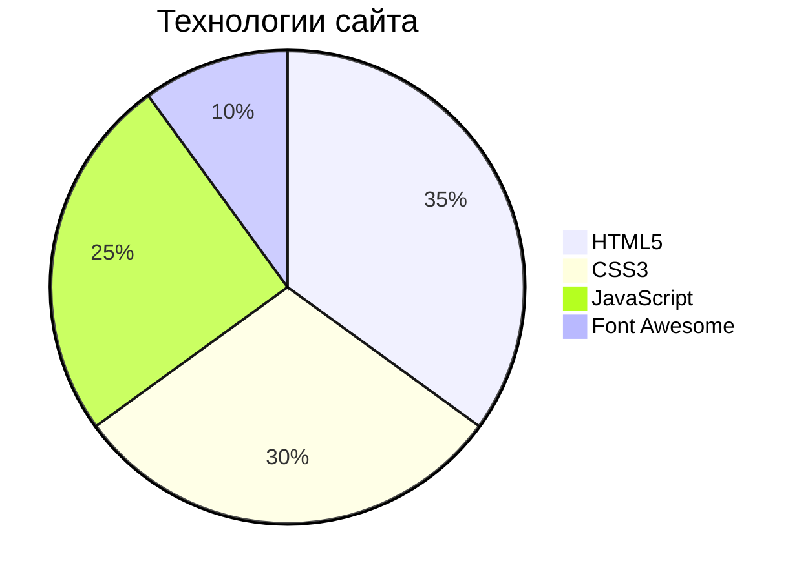

# Руководство по созданию сайта проекта EasyAccess

## Введение
Этот проект представляет собой сайт для расширения браузера EasyAccess, которое улучшает доступность интернета для людей с ограниченными возможностями. В руководстве я подробно опишу процесс создания сайта от исследования до реализации.



## Последовательность действий по созданию сайта

### 1. Исследование предметной области
- **Определение функциональных требований**:
  - Информация о проекте
  - Демонстрация возможностей
  - Журнал разработки
  - Ресурсы для разработчиков

### 2. Планирование структуры сайта


### 3. Проектирование интерфейса
- **Создание wireframes**:
  - Главная страница с аннотацией
  - Страница о проекте с деталями
  - Страница участников с карточками
  - Журнал с постами
  - Ресурсы с полезными ссылками
- **Разработка дизайн-системы**:
  - Цветовая палитра: синий (#4361EE), акцентный розовый (#F72585)
  - Типографика: Montserrat для заголовков, Roboto для текста
  - Компоненты: карточки, навигация, футер

### 4. Разработка фронтенда
- **HTML5** для семантической разметки
- **CSS3** с использованием переменных и Flexbox/Grid
- **JavaScript** для интерактивных элементов
- **Font Awesome** для иконок

## Пошаговое техническое руководство

### Шаг 1: Настройка проекта
Создайте структуру файлов:
```
easyaccess-site/
├── index.html
├── about.html
├── team.html
├── journal.html
├── resources.html
├── styles.css
├── script.js
└── images/
    └── logo.png
    └── ...
```

### Шаг 2: Базовая HTML-структура
Создайте основной каркас для всех страниц (`index.html`):

```html
<!DOCTYPE html>
<html lang="ru">
<head>
    <meta charset="UTF-8">
    <meta name="viewport" content="width=device-width, initial-scale=1.0">
    <title>EasyAccess - Главная</title>
    <link rel="stylesheet" href="styles.css">
    <link rel="stylesheet" href="https://cdnjs.cloudflare.com/ajax/libs/font-awesome/6.0.0/css/all.min.css">
</head>
<body>
    <header>
        <!-- Шапка сайта -->
    </header>
    
    <nav>
        <!-- Навигационное меню -->
    </nav>
    
    <div class="container">
        <!-- Основное содержимое -->
    </div>
    
    <footer class="site-footer">
        <!-- Подвал сайта -->
    </footer>
    
    <div class="back-to-top">
        <i class="fas fa-arrow-up"></i>
    </div>
    
    <script src="script.js"></script>
</body>
</html>
```

### Шаг 3: Создание шапки сайта
Добавьте в `<header>`:

```html
<div class="header-content">
    
    <div class="text-content">
        <h1>Проект EasyAccess</h1>
        <p>Сделаем интернет доступным для всех</p>
    </div>
</div>
```

### Шаг 4: Навигационное меню
Добавьте в `<nav>`:

```html
<div class="nav-container">
    <button class="nav-toggle">
        <i class="fas fa-bars"></i>
    </button>
    <div class="nav-links">
        <a href="index.html">Главная</a>
        <a href="about.html">О проекте</a>
        <a href="team.html">Участники</a>
        <a href="journal.html">Журнал</a>
        <a href="resources.html">Ресурсы</a>
    </div>
</div>
```

### Шаг 5: Основные стили (styles.css)
Создайте базовые стили:

```css
/* Переменные CSS */
:root {
    --primary: #4361EE;
    --primary-dark: #3A0CA3;
    --accent: #F72585;
    --light-bg: #F8F9FA;
    --dark-text: #212529;
    --medium-text: #7B7B7B;
    --white: #FFFFFF;
    --shadow-sm: 0 2px 10px rgba(0, 0, 0, 0.05);
    --shadow-md: 0 4px 20px rgba(0, 0, 0, 0.1);
    --shadow-lg: 0 10px 30px rgba(0, 0, 0, 0.15);
    --radius-sm: 8px;
    --radius-md: 12px;
    --radius-lg: 20px;
    --transition: all 0.3s ease;
}

/* Базовые стили */
* {
    margin: 0;
    padding: 0;
    box-sizing: border-box;
}

body {
    font-family: 'Roboto', sans-serif;
    background-color: var(--light-bg);
    color: var(--dark-text);
    line-height: 1.6;
}

.container {
    width: 90%;
    max-width: 1200px;
    margin: 0 auto;
    padding: 60px 0;
}

/* Стили карточек */
.card {
    background-color: var(--white);
    border-radius: var(--radius-md);
    box-shadow: var(--shadow-md);
    padding: 30px;
    margin-bottom: 30px;
    transition: var(--transition);
}
```

### Шаг 6: JavaScript для интерактивности (script.js)
Добавьте базовую функциональность:

```javascript
document.addEventListener('DOMContentLoaded', function() {
    // Мобильное меню
    const navToggle = document.querySelector('.nav-toggle');
    const navLinks = document.querySelector('.nav-links');
    
    if (navToggle && navLinks) {
        navToggle.addEventListener('click', function() {
            navLinks.classList.toggle('active');
            this.classList.toggle('active');
        });
    }
    
    // Кнопка "Наверх"
    const backToTopBtn = document.querySelector('.back-to-top');
    if (backToTopBtn) {
        window.addEventListener('scroll', function() {
            if (window.pageYOffset > 300) {
                backToTopBtn.classList.add('visible');
            } else {
                backToTopBtn.classList.remove('visible');
            }
        });
        
        backToTopBtn.addEventListener('click', function() {
            window.scrollTo({
                top: 0,
                behavior: 'smooth'
            });
        });
    }
    
    // Анимации при прокрутке
    const animatedElements = document.querySelectorAll('.animate-on-scroll');
    
    function checkScroll() {
        animatedElements.forEach(element => {
            const elementTop = element.getBoundingClientRect().top;
            const windowHeight = window.innerHeight;
            
            if (elementTop < windowHeight * 0.8) {
                element.classList.add('animate-fade-in');
            }
        });
    }
    
    window.addEventListener('scroll', checkScroll);
    checkScroll();
});
```

### Шаг 7: Создание карточек контента
Пример для главной страницы:

```html
<section class="intro animate-on-scroll">
    <h2>Аннотация проекта</h2>
    <p>Проект <strong>EasyAccess</strong> разрабатывается с целью улучшения доступности интернета...</p>
</section>

<section class="features animate-on-scroll">
    <h2>Основные возможности</h2>
    <ul>
        <li><strong>Текст в речь:</strong> Преобразование текста на странице в аудио...</li>
        <!-- Другие пункты -->
    </ul>
</section>
```

### Шаг 8: Адаптивный дизайн
Добавьте медиа-запросы в CSS:

```css
@media (max-width: 768px) {
    .nav-container {
        flex-direction: column;
    }
    
    .nav-links {
        flex-direction: column;
        display: none;
    }
    
    .nav-links.active {
        display: flex;
    }
    
    nav a {
        padding: 15px;
        border-top: 1px solid rgba(0, 0, 0, 0.05);
    }
    
    .nav-toggle {
        display: block;
        position: absolute;
        top: 15px;
        right: 20px;
    }
    
    .post-card {
        flex-direction: column;
    }
}
```

### Шаг 9: Анимации
Добавьте CSS-анимации:

```css
@keyframes fadeIn {
    from { opacity: 0; transform: translateY(20px); }
    to { opacity: 1; transform: translateY(0); }
}

.animate-fade-in {
    animation: fadeIn 0.8s ease forwards;
}

.card:hover {
    transform: translateY(-5px);
    box-shadow: var(--shadow-lg);
}
```

## Визуализация компонентов

### 1. Структура навигации


### 2. Анимации при прокрутке



## Заключение

Этот сайт был создан с использованием современных веб-технологий с акцентом на:
- **Доступность** (семантическая разметка, контрастность)
- **Адаптивность** (работа на всех устройствах)
- **Интерактивность** (плавные анимации)



Это руководство поможет вам создать аналогичный сайт для вашего проекта.

Для реализации используйте предоставленные примеры кода и диаграммы для понимания структуры компонентов. Удачи в разработке!
