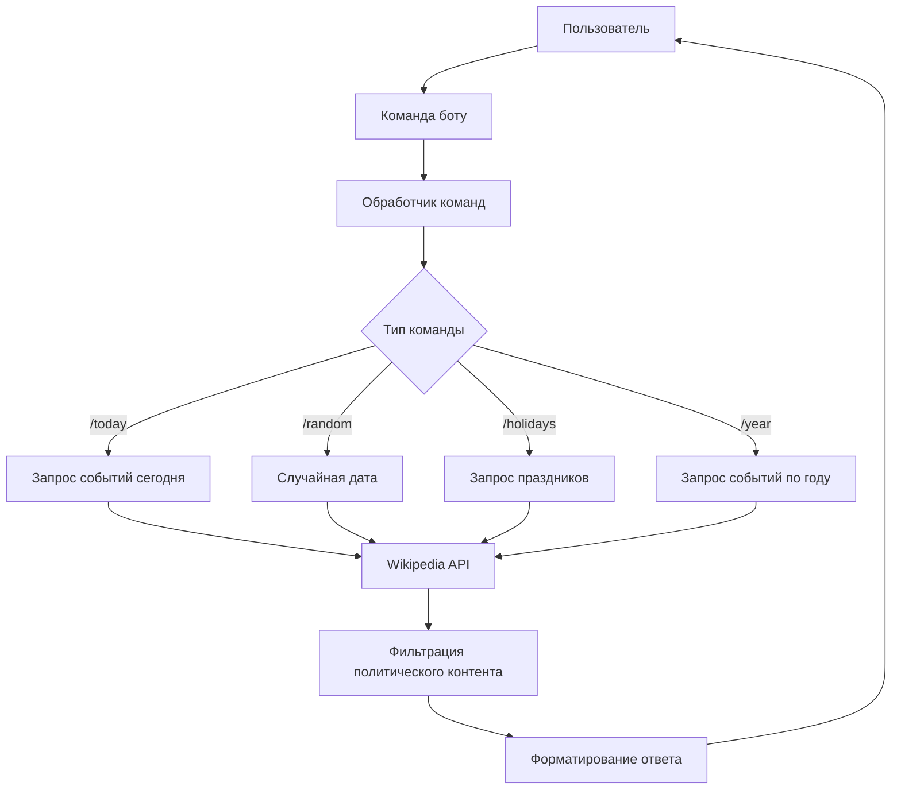
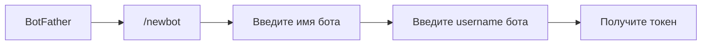
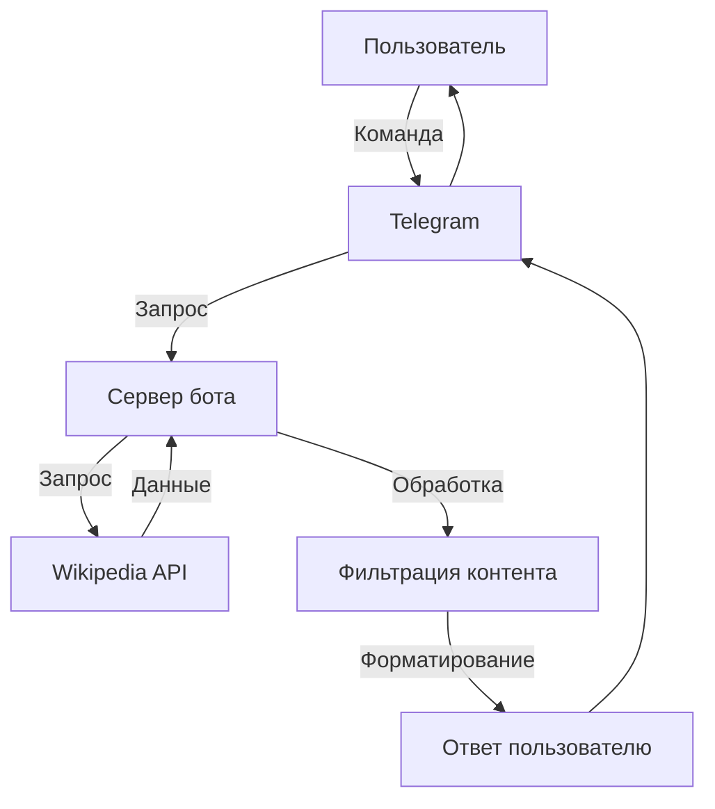
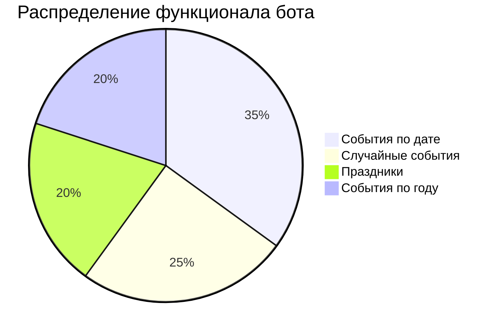

# Телеграм-бот Historius: Исторические события и праздники

## Последовательность действий по исследованию и созданию технологии

### Этап 1: Исследование предметной области
**Цель**: Создать бота, который предоставляет исторические события и праздники без политической окраски

1. **Анализ источников данных**: Выбор Wikipedia API как основного источника исторических данных
2. **Изучение API Wikipedia**: Исследование REST API для получения событий "On This Day"
3. **Определение функционала**:
   - События текущего дня
   - Случайные исторические события
   - Праздники на текущую дату
   - События по указанному году
4. **Разработка фильтров**: Создание списка политических ключевых слов для исключения нежелательного контента

### Этап 2: Проектирование системы


### Этап 3: Разработка
1. **Выбор технологического стека**:
   - Python 3.9+
   - Библиотека aiogram для работы с Telegram API
   - aiohttp для асинхронных HTTP-запросов
   - python-dotenv для управления конфигурацией

2. **Архитектура проекта**:
   ```
   historius-bot/
   ├── mybot.py         # Основной код бота
   ├── secret.env       # Токен бота
   ├── requirements.txt # Зависимости
   └── .gitignore       # Игнорируемые файлы
   ```

3. **Ключевые компоненты**:
   - Модуль фильтрации политического контента
   - Обработчик запросов к Wikipedia API
   - Система форматирования ответов
   - Обработчики команд Telegram


### Этап 4: Тестирование и оптимизация
1. Проверка корректности фильтрации политического контента
2. Тестирование обработки крайних случаев (29 февраля, пустые ответы API)
3. Оптимизация производительности:
   - Ограничение времени ожидания запросов
   - Повторные попытки при сбоях
   - Кэширование частых запросов

## Техническое руководство по созданию бота

### Шаг 1: Подготовка окружения

**Установка Python и зависимостей**:
```bash
# Установка Python 3.9
sudo apt update
sudo apt install python3.9 python3.9-venv

# Создание виртуального окружения
python3.9 -m venv venv
source venv/bin/activate

# Установка библиотек
pip install aiogram aiohttp python-dotenv
```

**Файл requirements.txt**:
```txt
aiogram==3.0
aiohttp==3.9.0
python-dotenv==1.0.0
```

### Шаг 2: Создание бота в Telegram
1. Найти @BotFather в Telegram
2. Использовать команду `/newbot`
3. Выбрать имя для бота (например, `HistoriusBot`)
4. Получить токен доступа


### Шаг 3: Базовая структура проекта

**Содержимое .gitignore**:
```gitignore
secret.env
__pycache__/
venv/
```

**Файл secret.env**:
```env
BOT_TOKEN=ваш_токен_бота
```

### Шаг 4: Реализация основных функций

**Инициализация бота**:
```python
import os
from dotenv import load_dotenv
from aiogram import Bot, Dispatcher

load_dotenv("secret.env")
TOKEN = os.getenv("BOT_TOKEN")

bot = Bot(token=TOKEN)
dp = Dispatcher()
```

**Фильтрация политического контента**:
```python
POLITICAL_KEYWORDS = {
    'политик', 'президент', 'правительство', 'парламент', 
    'выборы', 'голосование', 'партия', 'революция'
}

def is_political(text: str) -> bool:
    text_lower = text.lower()
    return any(keyword in text_lower for keyword in POLITICAL_KEYWORDS)
```

**Работа с Wikipedia API**:
```python
import aiohttp

async def fetch_json(url: str):
    try:
        async with aiohttp.ClientSession(timeout=aiohttp.ClientTimeout(total=10)) as session:
            async with session.get(url) as response:
                if response.status == 200:
                    return await response.json()
                return None
    except Exception as e:
        print(f"Ошибка запроса: {e}")
        return None
```

### Шаг 5: Реализация команд бота

**Обработка команды /today**:
```python
from aiogram.types import Message
from aiogram.filters import Command
from datetime import datetime

MONTHS = {
    1: "января", 2: "февраля", 3: "марта", 4: "апреля", 
    5: "мая", 6: "июня", 7: "июля", 8: "августа",
    9: "сентября", 10: "октября", 11: "ноября", 12: "декабря"
}

@dp.message(Command("today"))
async def cmd_today(message: Message):
    now = datetime.now()
    event = await get_event(now.month, now.day)
    if event:
        year, text = event
        response = f"📅 {now.day} {MONTHS[now.month]} {year}\n\n{text}"
    else:
        response = "🤷‍ Сегодня событий не нашёл."
    await message.answer(response)
```

**Обработка команды /random**:
```python
import random

@dp.message(Command("random"))
async def cmd_random(message: Message):
    month = random.randint(1, 12)
    day = random.randint(1, 28 if month == 2 else 31)
    event = await get_event(month, day)
    if event:
        year, text = event
        response = f"🎲 {day} {MONTHS[month]} {year}\n\n{text}"
    else:
        response = "🤷‍ В этот день ничего не найдено."
    await message.answer(response)
```

### Шаг 6: Запуск и развертывание

**Локальный запуск**:
```bash
python mybot.py
```

**Запуск на сервере** (systemd service):
```ini
# /etc/systemd/system/historius-bot.service
[Unit]
Description=Historius Telegram Bot
After=network.target

[Service]
User=ubuntu
WorkingDirectory=/path/to/bot
ExecStart=/path/to/venv/bin/python /path/to/bot/mybot.py
Restart=always

[Install]
WantedBy=multi-user.target
```



## Примеры работы бота

### Команда /today
```
📅 29 мая 1860  
День рождения художника Ивана Айвазовского, 
известного своими морскими пейзажами.
```

### Команда /year 1969
```
📜 События 1969 года:
• Первая высадка человека на Луну
• Запуск сверхзвукового самолета Concorde
• Вудстокский музыкальный фестиваль
```

### Команда /holidays
```
🎉 Праздники — 29 мая:
— День ветеранов таможенной службы
— Международный день миротворцев
— День химика
```

## Заключение



**Дальнейшее развитие**:
1. Добавление ежедневных автоматических уведомлений
2. Интеграция с другими историческими источниками
3. Система пользовательских предпочтений
4. Визуализация исторических данных (графики, временные ленты)

**Финал**: Бот готов к использованию и может быть развернут на любом сервере с поддержкой Python 3.9+
